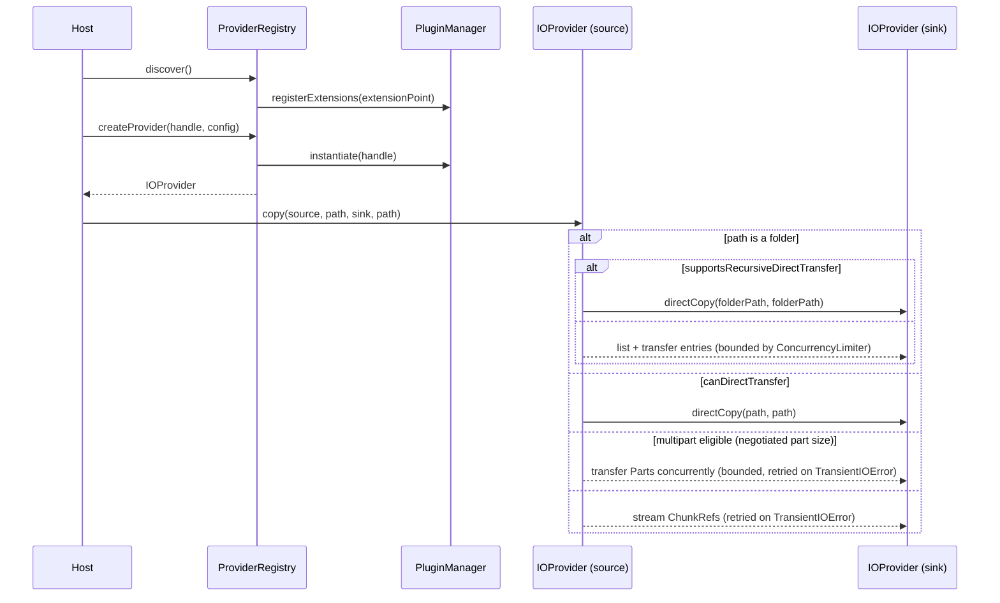

# pluggable-io-framework

[](https://github.com/flowscripter/pluggable-io-framework/releases)
[](https://github.com/flowscripter/pluggable-io-framework/actions/workflows/release-bun-library.yml)
[](https://flowscripter.github.io/pluggable-io-framework/index.html)
[](https://github.com/flowscripter/pluggable-io-framework/blob/main/LICENSE)

> A pluggable source/sink IO framework using https://github.com/flowscripter/dynamic-plugin-framework

## Key Features

- Discovers and instantiates source/sink provider plugins (implementing the
  `IOProviderFactory`/`IOProvider` contract from
  [pluggable-io-framework-api](https://github.com/flowscripter/pluggable-io-framework-api))
  via
  [dynamic-plugin-framework](https://github.com/flowscripter/dynamic-plugin-framework),
  including config validation against each plugin's Zod schema.
- Copy/move orchestration:
  - Uses a provider's `directCopy`/`directMove` when
    `canDirectTransfer` reports the source and sink are the same
    underlying provider (e.g. same filesystem mount, same object storage
    bucket).
  - Otherwise transfers via multipart (when both sides support it and file
    size crosses a configurable threshold) or plain streaming.
  - Multipart part size is negotiated between source and sink via
    `getPartSizeConstraints` (e.g. reconciling S3's minimum part size and
    10000-part cap on both ends) - see [Part-size negotiation](#part-size-negotiation).
  - A folder `sourcePath` recurses: a folder-aware `directCopy`/`directMove`
    when the source declares `supportsRecursiveDirectTransfer`, otherwise a
    concurrency-bounded listing-driven transfer following `cp -r` target
    semantics - see [Recursive copy/move](#recursive-copymove).
  - Concurrent multipart parts and recursive entries are bounded by a shared
    `ConcurrencyLimiter` - see [Concurrency](#concurrency).
  - The non-direct transfer path is retried on `TransientIOError` - see
    [Retries](#retries).
  - Reports progress via a global `TelemetryHooks` callback, tagged with a
    per-operation correlation id; multipart parts and recursive entries
    report their own child stream tagged with `parentOperationId`.
- Stream decorators:
  - `seekable` wraps a handle that supports `RangeReadable` with a single
    logical stream whose read position can be jumped via `seek(offset)`,
    instead of requiring a fresh stream per range.
  - `locallyCached` wraps a `StreamHandle` factory so the underlying source
    is read at most once - later calls replay cached chunks in memory
    without touching the source again.
- See
  [io-plugin-filesystem](https://github.com/flowscripter/io-plugin-filesystem)
  for a reference local filesystem source/sink plugin.

## Bun Module Usage

Add the module:

`bun add @flowscripter/pluggable-io-framework`

Discover and use a provider:

```typescript
import {
  DefaultPluginManager,
  LocalFolderPluginRepository,
} from "@flowscripter/dynamic-plugin-framework";
import { ProviderRegistry, copy } from "@flowscripter/pluggable-io-framework";

const pluginManager = new DefaultPluginManager([new LocalFolderPluginRepository("./plugins")]);
const registry = new ProviderRegistry(pluginManager);
await registry.discover();

const [extension] = await registry.listAvailableProviders();
const provider = await registry.createProvider(extension.extensionHandle, { rootPath: "/data" });

await copy(provider, "a.txt", provider, "b.txt", {
  telemetry: { onProgress: (event) => console.log(event) },
});
```

## Usage Example

The following example project is available:

- [flowscripter-io-cli](https://github.com/flowscripter/flowscripter-io-cli) is
  an example CLI application based on this framework.

## Part-size negotiation

Before a multipart transfer, `copy()`/`move()` call `getPartSizeConstraints(totalSize)`
on both `source` and `sink` (when implemented - a missing implementation is
treated as unconstrained) and reconcile the two into a single part size:
the larger of the two minimums, clamped to the smaller of the two maximums,
bumped up if needed so the total number of parts never exceeds the smaller
of the two `maxParts` (e.g. S3's 10000-part cap on a very large file). If
the reconciled bounds are mutually infeasible, the transfer falls back to
plain streaming rather than failing.

## Recursive copy/move

When `sourcePath` is a folder, `copy()`/`move()` follow `cp -r`/`mv`
semantics for the destination: a `destPath` that doesn't exist becomes the
copy itself; an existing folder gets the source nested inside it as
`destPath/<source-basename>`; an existing file is rejected.

If the source provider declares `supportsRecursiveDirectTransfer: true` and
is direct-transfer-eligible with the sink, the whole folder is handed to a
single `directCopy`/`directMove` call. Otherwise the folder is listed
(`source.list(path, { recursive: true })`) and each entry is transferred
individually - folders via the optional `createFolder` capability (so empty
folders are preserved), files via the normal single-file path (which may
still resolve to a per-file `directCopy`/`directMove`). For a recursive
move without any direct-transfer capability, every entry is copied first;
the source folder is deleted as a single recursive `delete()` call only
after every entry has succeeded.

## Concurrency

Multipart parts and recursive-copy/move entries are bounded by a
`ConcurrencyLimiter` (`TransferOptions.concurrencyLimiter`), defaulting to
the exported `defaultConcurrencyLimiter` singleton - so two `copy()`/`move()`
calls in the same process share one cap unless a caller passes its own
isolated instance:

```typescript
import { defaultConcurrencyLimiter } from "@flowscripter/pluggable-io-framework";

defaultConcurrencyLimiter.setMaxConcurrency(8);
```

## Retries

The non-direct transfer path (plain streaming, multipart, and the
copy-then-delete in a non-direct `move()`) is retried via `TransferOptions.retry`
(`{ maxRetries, backoffMs? }`, defaulting to `{ maxRetries: 3 }`) whenever a
provider throws `TransientIOError` from `pluggable-io-framework-api`. Any
other error - including a plain, unwrapped `Error` - is treated as
non-retryable. Direct provider calls (`directCopy`/`directMove`) are never
retried by the framework, since backends like the AWS SDK already retry
internally. The underlying `withRetry` utility is exported standalone for
other call sites.

## Development

Install dependencies:

`bun install`

Build (produces `dist/` for Node.js and TypeScript consumers; Bun uses raw source directly):

`bun run build`

Test:

`bun test`

Format:

`bunx oxfmt`

Lint:

`bunx oxlint index.ts src/ tests/`

Generate HTML API Documentation:

`bunx typedoc index.ts`

## Documentation

### Overview



### API

Link to auto-generated API docs:

[API Documentation](https://flowscripter.github.io/pluggable-io-framework/index.html)

## License

MIT © Flowscripter
