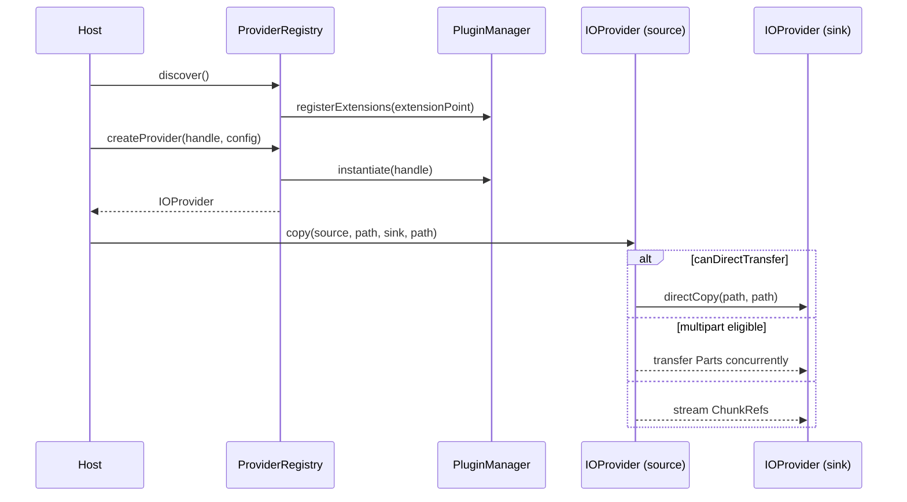

# pluggable-io-framework

[](https://github.com/flowscripter/pluggable-io-framework/releases)
[](https://github.com/flowscripter/pluggable-io-framework/actions/workflows/release-bun-library.yml)
[](https://flowscripter.github.io/pluggable-io-framework/index.html)
[](https://github.com/flowscripter/pluggable-io-framework/blob/main/LICENSE)

> A pluggable source/sink IO framework using https://github.com/flowscripter/dynamic-plugin-framework

## Key Features

- Discovers and instantiates source/sink provider plugins (implementing the
  `IOProviderFactory`/`IOProvider` contract from
  [pluggable-io-framework-api](https://github.com/flowscripter/pluggable-io-framework-api))
  via
  [dynamic-plugin-framework](https://github.com/flowscripter/dynamic-plugin-framework),
  including config validation against each plugin's Zod schema.
- Copy/move orchestration:
  - Uses a provider's `directCopy`/`directMove` when
    `canDirectTransfer` reports the source and sink are the same
    underlying provider (e.g. same filesystem mount, same object storage
    bucket).
  - Otherwise transfers via multipart (when both sides support it and file
    size crosses a configurable threshold) or plain streaming.
  - Reports progress via a global `TelemetryHooks` callback, tagged with a
    per-operation correlation id.
- Stream decorators:
  - `seekable` wraps a handle that supports `RangeReadable` with a single
    logical stream whose read position can be jumped via `seek(offset)`,
    instead of requiring a fresh stream per range.
  - `locallyCached` wraps a `StreamHandle` factory so the underlying source
    is read at most once - later calls replay cached chunks in memory
    without touching the source again.
- See
  [io-plugin-filesystem](https://github.com/flowscripter/io-plugin-filesystem)
  for a reference local filesystem source/sink plugin.

## Bun Module Usage

Add the module:

`bun add @flowscripter/pluggable-io-framework`

Discover and use a provider:

```typescript
import {
  DefaultPluginManager,
  LocalFolderPluginRepository,
} from "@flowscripter/dynamic-plugin-framework";
import { ProviderRegistry, copy } from "@flowscripter/pluggable-io-framework";

const pluginManager = new DefaultPluginManager([new LocalFolderPluginRepository("./plugins")]);
const registry = new ProviderRegistry(pluginManager);
await registry.discover();

const [extension] = await registry.listAvailableProviders();
const provider = await registry.createProvider(extension.extensionHandle, { rootPath: "/data" });

await copy(provider, "a.txt", provider, "b.txt", {
  telemetry: { onProgress: (event) => console.log(event) },
});
```

## Usage Example

The following example project is available:

- [flowscripter-io-cli](https://github.com/flowscripter/flowscripter-io-cli) is
  an example CLI application based on this framework.

## Development

Install dependencies:

`bun install`

Build (produces `dist/` for Node.js and TypeScript consumers; Bun uses raw source directly):

`bun run build`

Test:

`bun test`

Format:

`bunx oxfmt`

Lint:

`bunx oxlint index.ts src/ tests/`

Generate HTML API Documentation:

`bunx typedoc index.ts`

## Documentation

### Overview



### API

Link to auto-generated API docs:

[API Documentation](https://flowscripter.github.io/pluggable-io-framework/index.html)

## License

MIT © Flowscripter
