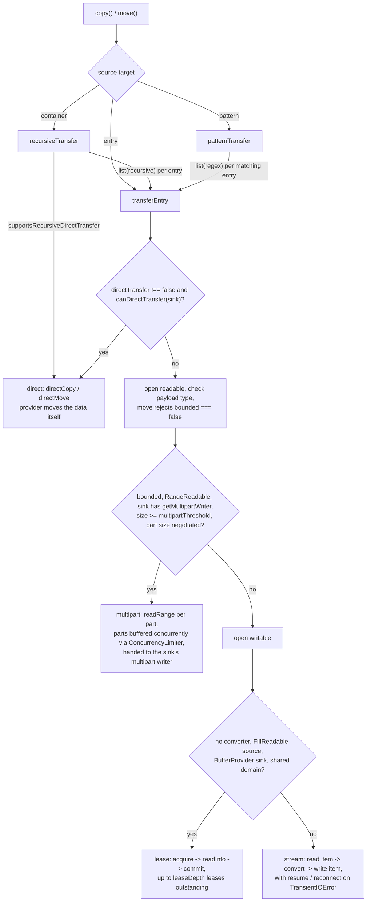
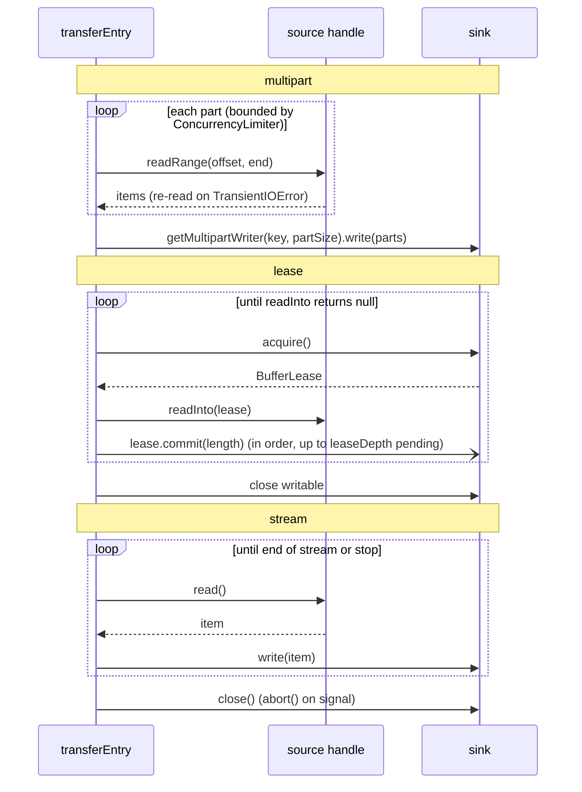
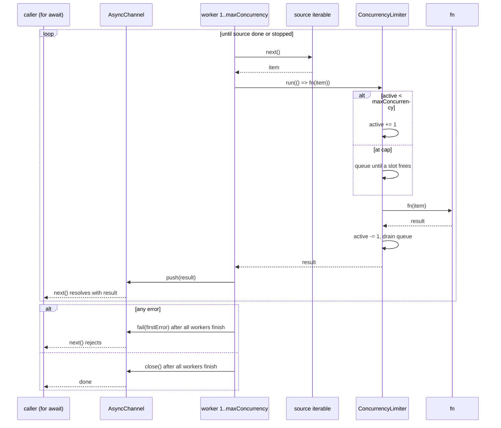
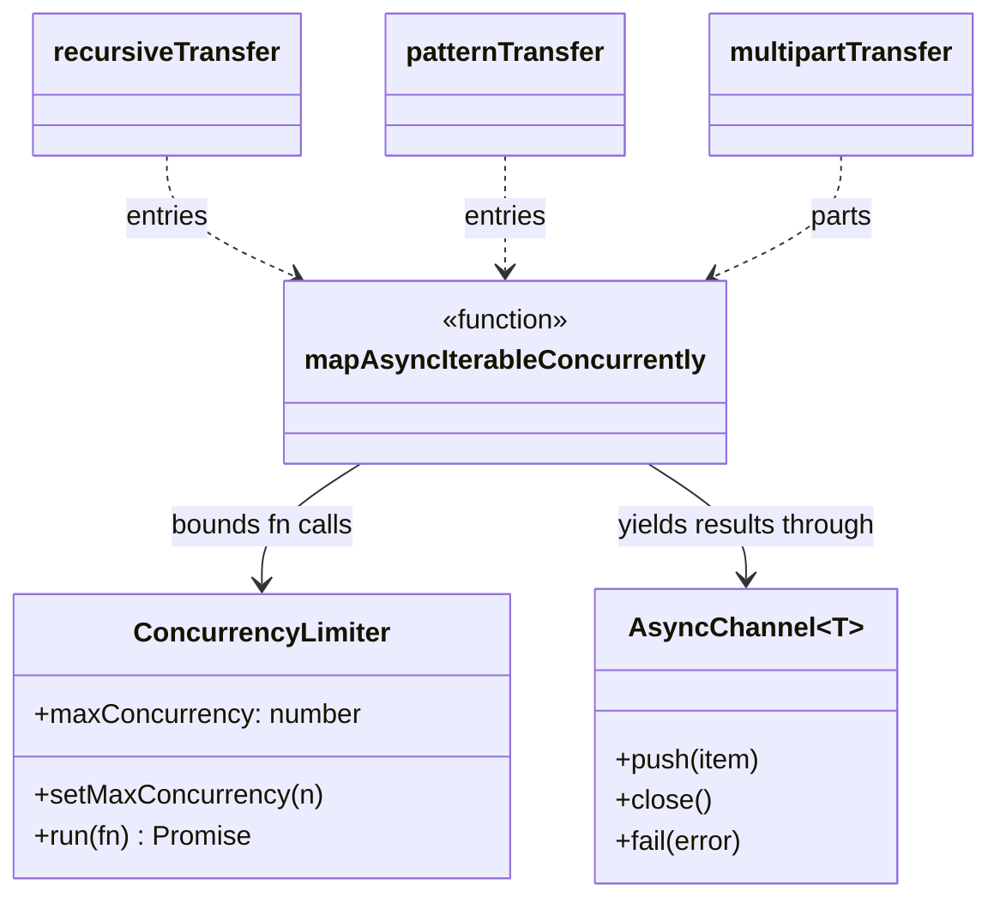
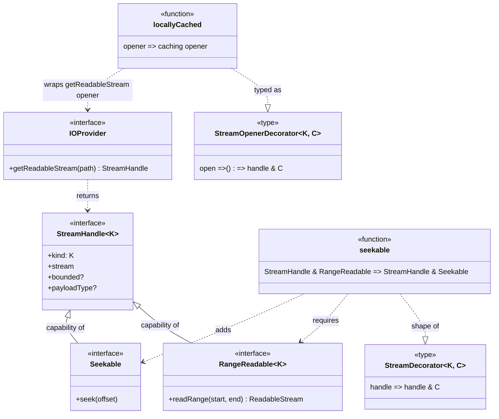
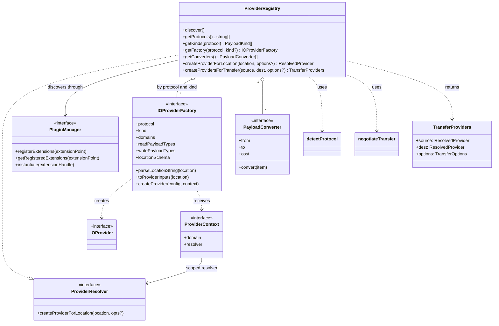
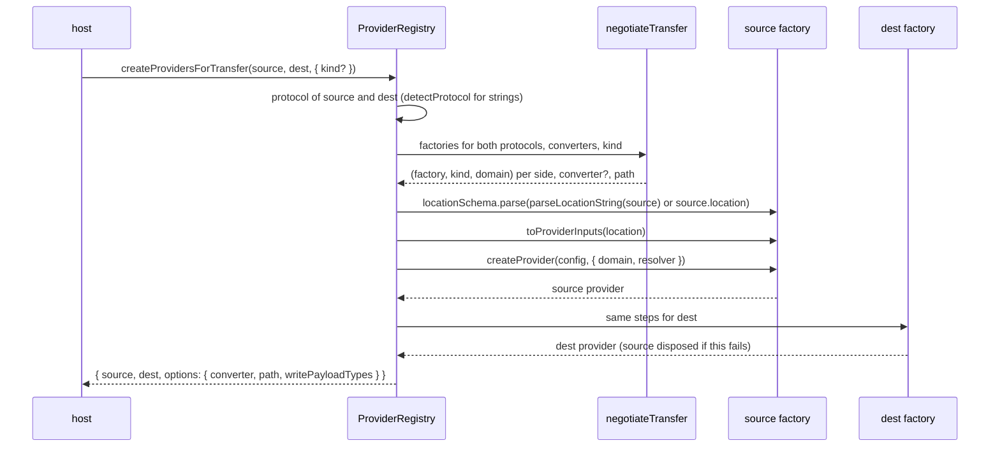

# Implementation Details

## Choosing a Transfer Strategy

For each entry, `copy`/`move` choose one strategy:

1. **Direct**: when `TransferOptions.directTransfer` is not `false` and
   `source.canDirectTransfer(sink)` is true, the provider's own
   `directCopy`/`directMove` is used.
2. **Multipart**: when the source is bounded, its readable handle is
   `RangeReadable`, the sink has `getMultipartWriter`, the entry size reaches
   `multipartThreshold` and a part size can be negotiated.
3. **Lease**: when no converter is needed, the readable handle is
   `FillReadable`, the writable handle is a `BufferProvider`, and the sink's
   domain is one the source can fill.
4. **Stream**: otherwise, items are piped from the readable to the writable
   handle.

Before streaming, the source's payload type must be one of
`TransferOptions.writePayloadTypes` (`["bytes"]` by default), which
`createProvidersForTransfer` sets from the destination factory.

| Strategy  | Conditions                                                                | Behaviour                                                                           | Path suffix       |
| --------- | ------------------------------------------------------------------------- | ----------------------------------------------------------------------------------- | ----------------- |
| direct    | `canDirectTransfer(sink)` and `directTransfer` is not `false`             | calls the provider's `directCopy`/`directMove`; no streams in the framework         | `direct`          |
| multipart | bounded `RangeReadable` source, sink multipart writer, size >= threshold  | reads parts with `readRange`, retries a part on its own, writes via the sink writer | `multipart`       |
| lease     | no converter, `FillReadable` source and `BufferProvider` sink in a domain | the source fills sink-provided buffers which are committed in order                 | `lease (depth N)` |
| stream    | otherwise                                                                 | pipes items, applying the converter, with resume and live-source reconnection       | `stream`          |

The path suffix is appended to the negotiated path description in
`TransferResult.path`, so the result records which strategy moved the data.
For example, a stream transfer between two `file` providers reports
`file/js -> file/js, stream`.

## Part-Size Negotiation

Both providers report `getPartSizeConstraints(totalSize)` (a missing
implementation is unconstrained). The part size is the largest of both
minimums and defaults, raised so the part count stays within both
`maxParts`, and capped at the smaller maximum. If the bounds cannot be met,
the transfer streams instead. Parts are read with `readRange(start, end)`,
where `end` is exclusive.

## Lease Transfers

The engine acquires a buffer from the sink, has the source fill it, then
commits it. Up to `leaseDepth` leases (default 2, capped by the sink's
`maxOutstanding`) are outstanding, so reading the next lease overlaps
committing the previous one. Reads are serialised and commits happen in
order. Every lease not yet committed is released on abort, error or end of
stream.

## Retries and Resume

Only `TransientIOError`s are retried, up to `retry.maxRetries` with
`retry.backoffMs` between attempts:

- Multipart: a part whose read fails is re-read with `readRange` on its own,
  within the same upload. When the upload itself fails and the multipart
  writer exposes `resumeToken()`, a new writer is created with
  `getMultipartWriter(key, partSize, { resume })` and only the parts from
  the token's `offset` on are sent again. Otherwise the upload restarts.
- Bounded stream: if the source is `RangeReadable` and the writable handle
  exposes `resumeToken()`, the sink is reopened with
  `getWritableStream(key, { resume })` and the source re-read from the
  returned `startOffset`. Otherwise the transfer restarts.
- Live source failure: the source is reopened while the sink stays open,
  the first new item gets `attributes.discontinuity = true`, and
  `TelemetryHooks.onGap` is called. `retry.onGap: "fail"` fails instead.
- Live sink failure: the sink is reopened with its resume token, or the
  transfer fails.

For stream transfers `maxRetries` counts consecutive failures and resets
once an item is written. Direct transfers are not retried by the framework:
a provider's `directCopy`/`directMove` can retry internally, since it knows
which of its backend's failures are safe to repeat (the AWS SDK already
does this for S3 server-side copies).

## Recursive and Pattern Transfers

A container transfer resolves its destination with `cp -r` rules:

- a destination that doesn't exist becomes the copy;
- an existing container gets the source nested inside it as
  `<dest>/<source basename>`;
- an existing entry is rejected.

If the source declares `supportsRecursiveDirectTransfer` and a
direct transfer is allowed, the whole container is handed to one
`directCopy`/`directMove`. Otherwise the container is listed recursively,
sub-containers are recreated with `createContainer`, and each entry is
transferred individually. A non-direct move deletes the source container
once, after every entry succeeds.

A pattern transfer lists the source container non-recursively with the glob
translated to a regular expression, and transfers each matching entry
(containers are skipped) into the destination container. A pattern move
deletes each entry after it is transferred.

Child keys are built with the provider's `joinKey`, defaulting to a
`/`-join.

## Concurrency

Multipart parts and recursive or pattern entries are bounded by a
`ConcurrencyLimiter` (`TransferOptions.concurrencyLimiter`), defaulting to
the shared `defaultConcurrencyLimiter`, so concurrent `copy()`/`move()`
calls share one cap unless a caller passes its own instance.

`mapAsyncIterableConcurrently(source, fn, limiter)` starts
`limiter.maxConcurrency` worker loops. Each worker pulls the next source
item, runs `fn` inside `limiter.run` (which waits in a FIFO queue when the
limiter's active count is at its cap), and pushes the result onto an
`AsyncChannel` that the caller iterates. Results arrive in completion order.
Because each worker pulls only after finishing its previous item, at most
`maxConcurrency` items are pulled at once. The first error, from the source
or from `fn`, stops all workers from pulling more; in-flight items finish,
then the channel rethrows the error to the caller.

## Telemetry

Every operation reports progress through `TelemetryHooks.onProgress` with
its own `operationId`. Multipart parts and recursive or pattern entries
report under their own ids, tagged with the parent's id as
`parentOperationId`. Container operations report `entriesProcessed` and
`totalEntries`.

## Decorators

`seekable` turns a handle that can serve byte ranges into one logical
stream whose position can be moved: `seek(offset)` replaces the current
reader with `readRange(offset, ...)`.

`locallyCached` wraps the function that opens a handle rather than the
handle itself, because a handle's stream can only be read once: the first
open drains and caches the items, later opens replay them.

## Provider Registry and Provider Resolution

The registry passes a `ProviderResolver` to every provider it creates, so a
composite provider can obtain other installed providers. Inner providers
default to the outer provider's kind and domain, and resolution fails with
`PermanentIOError("provider resolution too deep")` beyond four nested
levels. The outer provider disposes the providers it resolved.

