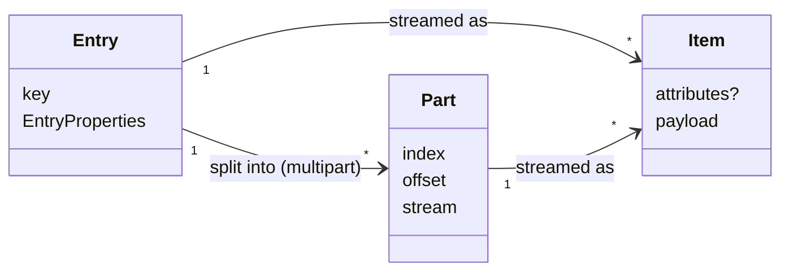

# Key Concepts

The contracts referred to here are defined in
[pluggable-io-framework-api](https://github.com/flowscripter/pluggable-io-framework-api).

## Providers and Factories

An `IOProviderFactory` serves one protocol (`file`, `s3`, `https`, ...) and
creates `IOProvider`s of one payload kind (`js` or `native`). At most one
factory may be installed for each (protocol, kind) pair. Native factories
also declare the memory domains they support, and every factory declares
the payload types it can read and write (`bytes` by default).

## Locations and Targets

A location is given as a string or as a `StructuredLocation` (see below).
Either way, the factory validates the raw location object against its
`locationSchema` and turns it into provider config plus a `LocationTarget`:

| Target      | Meaning                                    |
| ----------- | ------------------------------------------ |
| `entry`     | a single entry (file, object, resource)    |
| `container` | a whole container (directory, prefix)      |
| `pattern`   | the entries in a container matching a glob |

## String and Structured Locations

`ProviderRegistry.createProviderForLocation` and
`createProvidersForTransfer` accept both forms.

A string, such as `file:///data/a.txt` or `s3://bucket/key`:

- `detectProtocol` reads its scheme (two or more characters, so a Windows
  drive letter is not mistaken for one), defaulting to `file`. For a
  composite scheme the protocol is the part before the first `+`.
- The factory's `parseLocationString` turns it into a raw location object.
  It can only carry what the protocol's URL form carries: for `file` that is
  a `path`, which always becomes a `container` target, and for `s3` a
  bucket and key without region, endpoint or credentials.
- It is the form `ProviderResolver.createProviderForLocation` takes. A
  composite provider resolves URLs it discovers at runtime, such as segment
  URLs from an API, so strings are needed there. Strings are also the
  convenient form for code that already holds a URL.

A `StructuredLocation`, `{ protocol, location }`:

- `location` is the raw location object itself, passed straight to the
  factory's `locationSchema` without `detectProtocol` or
  `parseLocationString`.
- It can carry every field the schema defines, including those a string
  cannot: `filename` for a single `entry` target, `pattern` for a `pattern`
  target, and connection settings and credentials.
- It suits hosts that collect location fields separately, such as a CLI
  building one argument per field.

## Entries, Items and Parts

- An **entry** is a single stored thing a provider addresses by key: a
  file, an object, an HTTP resource. Its metadata is `EntryProperties`.
  Entries live in **containers** (directories, prefixes).
- An **item** is the unit a stream carries: optional attributes plus a
  payload. Reading an entry through a stream handle yields a sequence of
  items, and writing items to a writable stream handle produces an entry.
  One entry is usually many items.
- A **part** is one byte range of an entry in a multipart transfer, with
  an `index`, an `offset` and its own stream of items. The framework splits
  an entry into parts with `readRange`, transfers them concurrently, and
  the sink's multipart writer reassembles them into the destination entry.

A `copy` of one entry therefore moves one entry's worth of items, either
as a single stream or as several parts; a container or pattern transfer
does this once per entry.

## Items, Payload Kinds, Domains and Types

Streams carry `Item`s: optional attributes plus a JS or native payload. A
stream has one payload kind. Native payloads also carry a memory domain
(`host` by default). A stream's payload type is an opaque ID (`bytes` by
default) that the framework only matches exactly.

## Negotiation

`ProviderRegistry.createProvidersForTransfer` picks a factory and domain for
each side, considering only combinations with a common payload type:

1. a common (kind, domain) - `js` first, then the source's domain order;
2. otherwise the cheapest single registered payload converter;
3. otherwise an error listing what each side supports.

An explicit kind restricts both sides to it. The result includes a
description of the negotiated path, which `copy`/`move` report back.

## Transfers

`copy` and `move` take a source and destination `LocationTarget`:

| Source      | Destination | Result                                    |
| ----------- | ----------- | ----------------------------------------- |
| `entry`     | `entry`     | writes exactly the destination key        |
| `entry`     | `container` | writes `<container>/<source basename>`    |
| `container` | `container` | recursive transfer with `cp -r` semantics |
| `pattern`   | `container` | one transfer per matching entry           |
| `container` | `entry`     | rejected                                  |
| `pattern`   | `entry`     | rejected                                  |
| any         | `pattern`   | rejected                                  |

Both resolve with a `TransferResult` (`stopped`, `bytes`, `items`, `path`).

## Stop and Cancel

- `signal` cancels: the source is cancelled, the sink aborted, and the
  transfer rejects with an `AbortError`.
- `stop` ends gracefully: the source is cancelled, the sink closed normally,
  and the result reports `stopped: true`. A stopped `move` never deletes its
  source.

## Live Sources

A readable handle with `bounded: false` is a live source that runs until
end of stream or `stop`. `move` rejects live sources.

## Decorators

- `seekable` wraps a `RangeReadable` handle with a single stream whose read
  position can be moved with `seek(offset)`.
- `locallyCached` wraps a stream opener so the source is read at most once
  and replayed from memory afterwards.
